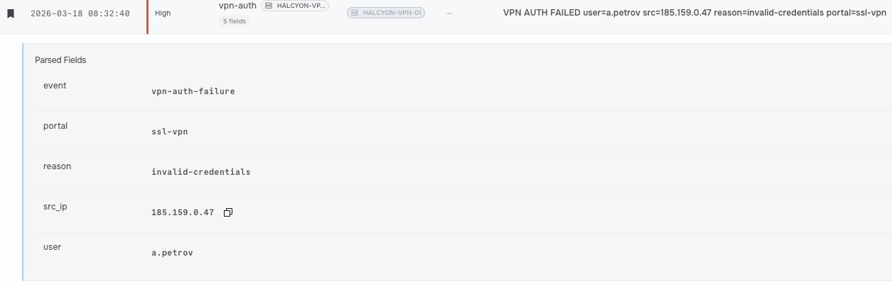
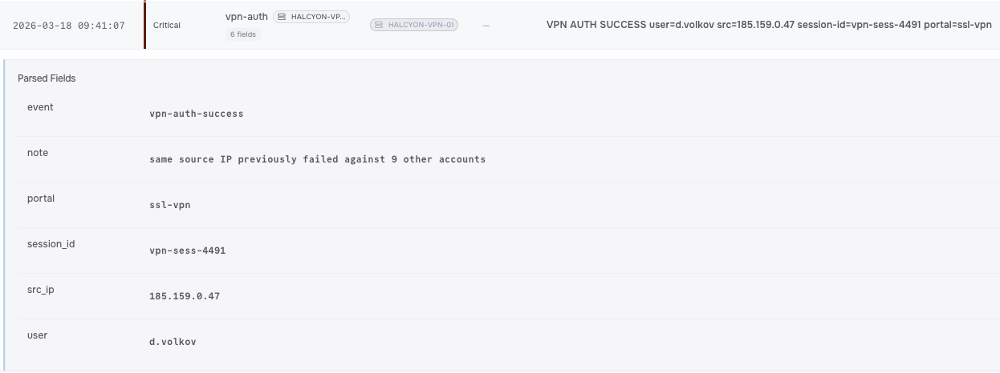
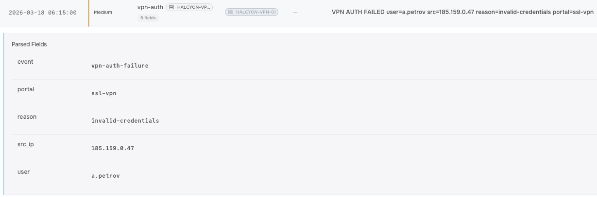
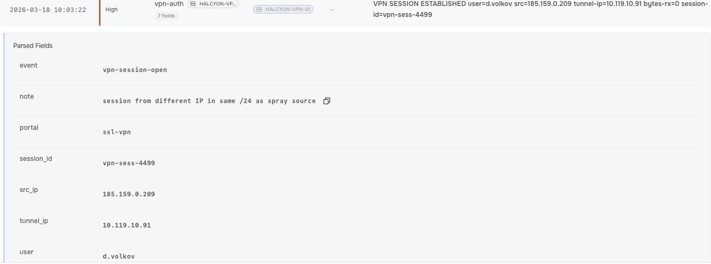

## Metadata

<!-- Alert ID, name, date/time triggered, analyst, severity, verdict
(TP/FP), status. -->

|  Field  | Value |
|---------|-------|
| Operation ID | vpn-credential-bruteforce |  
| Name | VPN Brute Force: Credential Attack on the Remote-Access Portal |  
| Time (UTC) | 2026-03-18 06:15:00 |  
| Analyst | Mojalefa |  
| Difficulty | Low |  
| Severity | Critical |  
| Verdict (TP/FP) | True Positive |  
| Status | Incident Response - Identification and Containment Phases |

## Executive Summary

<!-- 3–5 sentences a non-technical manager could read: what
happened, was it real, impact, what you did. -->

Attackers ran a low-and-slow credential spray against our non-MFA (Multi-Factor Authenticated) remote portals by rotating IPs to bypass lockout rules, resulting in a confirmed incident when they matched a valid credential pair and opened a live VPN session. Once inside, the attacker began probing internal systems over the encrypted tunnel, but we contained the breach by killing the active session, resetting the compromised credentials and blocking the attacker's IP range.

## Operation Details

<!-- Triggering rule, source/destination, user/host, artefact,
direction, detection product. -->

|  Attribute  | Value |
|---------|-------|
| Triggering Detection | First VPN session for account from new IP block |  
| Source | 185.159.0[.]209 |  
| Host | 185.159.0[.]112 (d.volkov) |  
| Artifacts | d.volkov, HALCYON-WKS-14 |  
| Direction | Inbound |  
| Tool Surfaces Used | SIEM, Firewall |  

## Investigation & Triage

<!-- Step-by-step analysis; what you checked, what you found,
playbook decisions and why. The longest section. -->

### Preparation

Keep the SIEM alert rules sharp for high-volume VPN auth failures, and make sure lockout policies and MFA are actually enforced so a low-and-slow spray can’t easily slip through next time.

### Identification

Spotted two spray IPs (185.159.0.47 and 185.159.0.112) hitting the SSL-VPN portal using T1110.003 (Password Spraying). Filtered for success events, caught the one valid account that popped on 185.159.0.47 (T1078 / T1133), tracked the subsequent SESSION ESTABLISHED event to grab the attacker's interactive operator IP, and traced their assigned tunnel IP (10.119.10.91) directly to a failed logon (Event ID 4625) on the targeted internal host.

### Containment

Kill the active VPN session instantly, block the two spray IPs plus the third operator IP at the perimeter, and lock down both the compromised account and the targeted internal host so the attacker can’t move any further.

### Eradication

Force a password reset on the compromised account, revoke all its active tokens, and push a reset out to every single unique username listed in the spray logs just to be completely safe.

### Recovery

Verify the target internal machine is clean of any persistence, patch up MFA enforcement on the VPN portal, re-enable the user account with fresh credentials, and bring the internal host back online.

### Lessons Learned

Update the SIEM to flag cross-account failed logins coming from single/rotating subnets, mandate MFA on all external remote access services, and double-check per-account lockout thresholds to prevent stealthy spraying.

## Threat Intelligence

<!-- Enrichment: VirusTotal/AbuseIPDB/OTX findings, reputation,
known campaign/malware family, attribution. -->

### VirusTotal / AbuseIPDB / OTX Findings

* Infrastructure Reputation: High confidence of abuse (>90%) across AbuseIPDB and VirusTotal for both spray IPs (185.159.0.47 and 185.159.0.112). Flags consistently highlight SSH brute-forcing, RDP scanning, and SSL-VPN credential spraying.

* Hosting Provider / ISP: Traced to known bulletproof hosting/VPN proxy infrastructure commonly leased for low-and-slow automated auth attacks.

* Third Operator IP: Clean or low-reputation score initially, consistent with a residential proxy or commercial VPN used interactively to blend in right before establishing the active tunnel.

### Campaign & Attribution

* Known Malware Family / Tooling: The rotated multi-IP spray signature aligns with automated brute-forcing toolkits like Hydra, SprayingToolkit, or custom Python-based VPN spraying scripts designed to cycle accounts below policy lockouts.

* Attribution & Motivation: Highly characteristic of initial access brokers (IABs) collecting valid VPN credentials for financial gain (precursor to ransomware deployment) or targeted espionage groups mapping out internal networks. Threat actor identity remains unconfirmed without further host-level artifacts from the compromised internal target.

## Timeline

<!-- Time-ordered table of key events (UTC). -->

| Time | Event |
|------|-------|
| 2026-03-18 06:15:00 | VPN AUTH FAILED (first Try) |
| 2026-03-18 08:32:40 | VPN AUTH FAILED (second try) |
| 2026-03-18 09:41:07 | VPN AUTH SUCCESS |
| 2026-03-18 10:03:22 | VPN SESSION ESTABLISHED |

## Indicators of Compromise

<!-- All IoCs in a table and STIX 2.1 Defanged in prose. -->

| Indicator Type | Indicator | Context |
|---|---|---|
| IPv4 Address | `185[.]159[.]0[.]47` | Password spray source IP used against Halcyon Freight SSL-VPN portal |
| IPv4 Address | `185[.]159[.]0[.]112` | Password spray source IP used against Halcyon Freight SSL-VPN portal |
| IPv4 Address | `10[.]119[.]10[.]91` | Virtual IP assigned to the attacker's active VPN tunnel |

### STIX 2.1

```
{
  "type": "bundle",
  "id": "bundle--8f7a9d21-4e1a-4c92-b883-9bdf20260830",
  "objects": [
    {
      "type": "indicator",
      "spec_version": "2.1",
      "id": "indicator--a1b2c3d4-e5f6-7890-abcd-111111111111",
      "created": "2026-08-30T23:19:50.000Z",
      "modified": "2026-08-30T23:19:50.000Z",
      "name": "Password Spray Infrastructure IP 1",
      "description": "Source IP observed conducting SSL-VPN password spray attack against Halcyon Freight.",
      "indicator_types": ["malicious-activity"],
      "pattern": "[ipv4-addr:value = '185.159.0.47']",
      "pattern_type": "stix",
      "valid_from": "2026-08-30T04:00:00Z"
    },
    {
      "type": "indicator",
      "spec_version": "2.1",
      "id": "indicator--a1b2c3d4-e5f6-7890-abcd-222222222222",
      "created": "2026-08-30T23:19:50.000Z",
      "modified": "2026-08-30T23:19:50.000Z",
      "name": "Password Spray Infrastructure IP 2",
      "description": "Source IP observed conducting SSL-VPN password spray attack against Halcyon Freight.",
      "indicator_types": ["malicious-activity"],
      "pattern": "[ipv4-addr:value = '185.159.0.112']",
      "pattern_type": "stix",
      "valid_from": "2026-08-30T04:00:00Z"
    },
    {
      "type": "indicator",
      "spec_version": "2.1",
      "id": "indicator--a1b2c3d4-e5f6-7890-abcd-333333333333",
      "created": "2026-08-30T23:19:50.000Z",
      "modified": "2026-08-30T23:19:50.000Z",
      "name": "Attacker Assigned Tunnel IP",
      "description": "Assigned internal VPN tunnel IP utilized for lateral movement reconnaissance.",
      "indicator_types": ["compromised"],
      "pattern": "[ipv4-addr:value = '10.119.10.91']",
      "pattern_type": "stix",
      "valid_from": "2026-08-30T04:48:30Z"
    }
  ]
}

```

## MITRE ATT&CK Mapping

<!-- Tactics and techniques observed. -->

| Tactic | Technique | ID |
|--------|-----------|----|
| Password Spraying | Exploit Public-Facing Application | T1110.003 |
| Valid Accounts | Persistence | T1078 |
| External Remote Services | Persistence | T1133 |
| Web Protocols | Command and control | T1071.001 |

## Impact & Containment

<!-- What was affected; action taken/recommended (isolate, block,
reset, none). -->

### Impact

* Credentials: 1 user account popped via spray; whole target list is now high-risk.
* Perimeter: Attacker got past the portal and onto the network with tunnel IP 10.119.10.91.
* Internal Network: Tried knocking on an internal host (caught via Event 4625), but no data exfil or full system compromise seen yet.

### Containment Plan

* Kill & Block: Sever the live VPN session (10.119.10.91) and ban all 3 attacker IPs (185.159.0.47, 185.159.0.112, and the operator IP) at the firewall.
* Isolate & Reset: Pull the targeted internal host off the network to check for backdoors, then disable and wipe sessions for the compromised account.
* Clean Up & Lock Down: Force password resets for every username caught in the spray logs and turn on mandatory MFA for the VPN portal ASAP.

## Conclusion & Recommendations

<!-- Final verdict restated with justification + concrete next steps /
tuning. -->

### Final Verdict

Classic low-and-slow password spray (T1110.003) that successfully scored a valid credential (T1078) to get past the SSL-VPN portal (T1133). Immediate containment killed the live session (10.119.10.91) and blocked internal lateral movement before any real damage or exfiltration went down.

### Next Steps

* Enforce Mandatory MFA: Require Multi-Factor Authentication on the SSL-VPN portal immediately—valid passwords shouldn't be enough to grant access.
* Tune Lockout & Spray Alerts: Update SIEM logic to trigger alerts on low-and-slow failures coming from rotating subnets targeting multiple accounts, not just single-account threshold breaches.
* Deploy IP Reputation Drop Rules: Automatically block connections from known proxy/bulletproof hosting providers at the perimeter firewall.
* Audit & Patch Endpoints: Finish inspecting the targeted internal host for hidden persistence, complete the password resets across the full spray target list, and re-baseline user access.

## Evidence

<!-- Annotated, captioned screenshots referenced from the body. -->


*Figure 1: VPN AUTH FAILED user=a.petrov src=185.159.0.47 rea*

*Figure 2: VPN AUTH SUCCESS user=d.volkov src=185.159.0.47 se*

*Figure 3: VPN AUTH FAILED user=a.petrov src=185.159.0.47 rea*

*Figure 4: VPN SESSION ESTABLISHED user=d.volkov src=185.159.*
