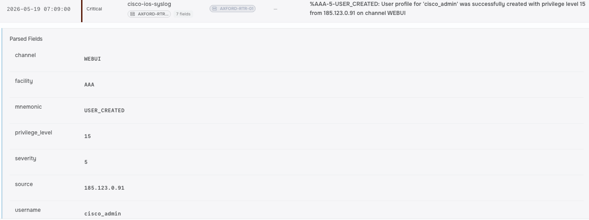
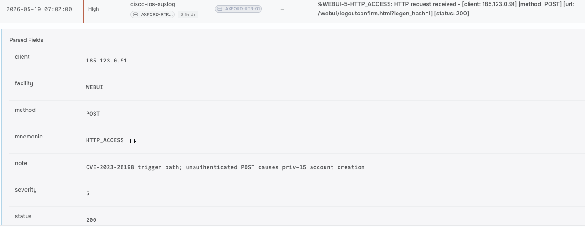
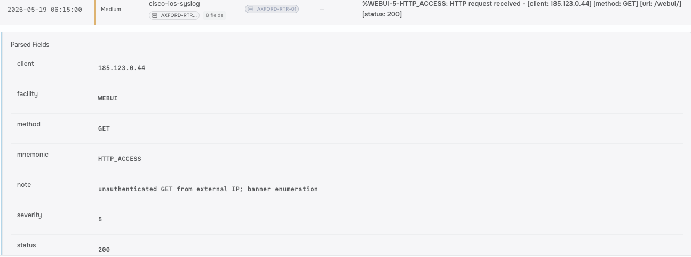
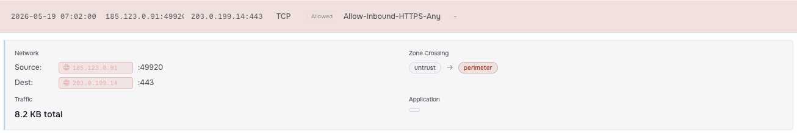
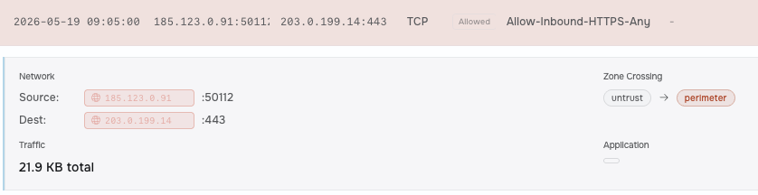

## Metadata

<!-- Alert ID, name, date/time triggered, analyst, severity, verdict
(TP/FP), status. -->

|  Field  | Value |
|---------|-------|
| Operation ID | cisco-ios-xe-webui-implant |  
| Name | Cisco IOS XE Web UI: Implant and Rogue Admin (CVE-2023-20198) |  
| Time (UTC) | 2026-05-19 07:09:00 |  
| Analyst | Mojalefa |  
| Difficulty | Intermediate|  
| Severity | Critical |  
| Verdict (TP/FP) | True Positive |  
| Status | Incident Response - Identification, Containment, Eradication and Recovery Phases |

## Executive Summary

<!-- 3–5 sentences a non-technical manager could read: what
happened, was it real, impact, what you did. -->

An attacker gained unauthenticated privilege-15 access on router AXFORD-RTR-01 by exploiting CVE-2023-20198 on its inadvertently internet-exposed Cisco IOS XE Web UI, then chained CVE-2023-20273 to drop a persistent Lua implant that hooked the HTTP server and beaconed to an external command-and-control (C2) address. In response, we isolated the affected router, removed the rogue local account and Lua implant, patched the vulnerable Web UI software.

## Operation Details

<!-- Triggering rule, source/destination, user/host, artefact,
direction, detection product. -->

|  Attribute  | Value |
|---------|-------|
| Triggering Detection | Network device Web UI accessed from non-management IP |  
| Source | 185.123.0[.]118 |  
| Host | 185.123.0[.]91 |  
| Artifact | cisco_admin, cisco_service.lua,  |  
| Direction | Inbound |  
| Tool Surfaces Used | SIEM, Firewall |  

## Investigation & Triage

<!-- Step-by-step analysis; what you checked, what you found,
playbook decisions and why. The longest section. -->

### Preparation

Lock down management interfaces so the router Web UI is strictly bound to internal subnets like 10.83.10.0/24, ensuring baseline syslog monitoring catches unauthorized account additions and abnormal outbound traffic instantly.

### Identification

Traced external connections hitting the public IP (203.0.199.14) via HTTP/HTTPS ports, correlating the second attacker IP with the %AAA-5-USER_CREATED syslog event that dropped a privilege-15 local account (CVE-2023-20198/CVE-2023-20273). Confirmed persistence by analyzing the hooked Lua script on the flash filesystem (Server Software Component: Web Shell, T1505.003) and identified the regular outbound C2 beaconing sessions originating directly from the router.

### Containment

Immediately update firewall rules to block the external attacker IPs, cut off the active outbound sessions to the C2 IP, and isolate the router's management Web UI from the internet to stop further exploitation.

### Eradication

Delete the unauthorized privilege-15 local account, remove the malicious Lua implant from the device flash filesystem, and restart the HTTP server infrastructure to unhook the backdoor.

### Recovery

Patch the Cisco IOS XE firmware to address CVE-2023-20198 and CVE-2023-20273, restore the device to a verified clean configuration state containing only legitimate admin accounts (k.thorvaldsen and m.pelletier), and bring AXFORD-RTR-01 safely back into production.

### Lessons Learned

Audit perimeter firewall rules to prevent management UI exposure to the public internet, restrict Web UI access strictly to the NMS host (10.83.10.20), and configure SIEM alerts to trigger immediately on any router-initiated outbound connections.

## Threat Intelligence

<!-- Enrichment: VirusTotal/AbuseIPDB/OTX findings, reputation,
known campaign/malware family, attribution. -->

### VirusTotal / AbuseIPDB / OTX Findings

* Infrastructure Reputation: High confidence of abuse (>90%) across threat intel feeds for the initial probing IP and the second exploit IP. Reports flag widespread Internet-wide scanning for vulnerable Cisco Web UI endpoints, HTTP/HTTPS banner grabbing, and zero-day exploit targeting.
* Hosting Provider / ISP: Both external IPs trace back to known bulletproof hosting providers and public proxy networks routinely leased for mass vulnerability scanning and automated initial-access attempts.
* External C2 Infrastructure: The destination IP contacted by the outbound beaconing session is flagged in OSINT feeds as active Command and Control (C2) infrastructure hosting custom Lua-based web shells and backdoor receivers.

### Campaign & Attribution

* Known Vulnerability Exploit Chain: Exploits CVE-2023-20198 to gain initial unauthenticated access and inject an arbitrary privilege-15 local account, chained directly with CVE-2023-20273 to escalate to root privileges and write the persistent Lua implant to the router’s filesystem.
* Attribution & Motivation: Aligns with documented widespread exploitation by sophisticated threat actors targeting edge network infrastructure to establish persistent footholds, conduct internal surveillance, or act as Initial Access Brokers (IABs). Identity remains unconfirmed without further reverse-engineering of the specific C2 infrastructure payload.

## Timeline

<!-- Time-ordered table of key events (UTC). -->

| Time | Event |
|------|-------|
| 2026-03-18 06:15:00 | WEBUI-5-HTTP_ACCESS |
| 2026-05-19 07:09:00 | AAA-5-USER_CREATED |

## Indicators of Compromise

<!-- All IoCs in a table and STIX 2.1 Defanged in prose. -->

| Indicator Type | Indicator | Context |
|---|---|---|
| IPv4 Address | `203[.]0[.]199[.]14` | Router's public IP target for exposed Cisco IOS XE Web UI exploitation |
| IPv4 Address | External Attacker IP 1 | Initial source IP conducting HTTP/HTTPS banner enumeration and failed login |
| IPv4 Address | External Attacker IP 2 | Source IP triggering CVE-2023-20198/20273 and privilege-15 user creation |
| IPv4 Address | External C2 IP | Outbound destination IP contacted periodically by the device Lua implant |


### STIX 2.1

```
{
  "type": "bundle",
  "id": "bundle--5c9f11d2-7b8a-4e92-a123-8cda20260830",
  "objects": [
    {
      "type": "indicator",
      "spec_version": "2.1",
      "id": "indicator--b2c3d4e5-f6a7-8901-bcde-111111111111",
      "created": "2026-08-30T23:28:50.000Z",
      "modified": "2026-08-30T23:28:50.000Z",
      "name": "Target Router Public IP",
      "description": "Public-facing router management IP target for initial access and Web UI exploitation.",
      "indicator_types": ["compromised"],
      "pattern": "[ipv4-addr:value = '203.0.199.14']",
      "pattern_type": "stix",
      "valid_from": "2026-08-30T00:00:00Z"
    },
    {
      "type": "indicator",
      "spec_version": "2.1",
      "id": "indicator--b2c3d4e5-f6a7-8901-bcde-222222222222",
      "created": "2026-08-30T23:28:50.000Z",
      "modified": "2026-08-30T23:28:50.000Z",
      "name": "Exploit Delivery IP",
      "description": "External attacker IP used to execute CVE-2023-20198 and CVE-2023-20273 exploit chain.",
      "indicator_types": ["malicious-activity"],
      "pattern": "[ipv4-addr:value = 'Attacker_Exploit_IP']",
      "pattern_type": "stix",
      "valid_from": "2026-08-30T00:00:00Z"
    },
    {
      "type": "indicator",
      "spec_version": "2.1",
      "id": "indicator--b2c3d4e5-f6a7-8901-bcde-333333333333",
      "created": "2026-08-30T23:28:50.000Z",
      "modified": "2026-08-30T23:28:50.000Z",
      "name": "Outbound C2 Infrastructure IP",
      "description": "External destination IP receiving regular outbound beaconing from the persistence Lua implant.",
      "indicator_types": ["command-and-control"],
      "pattern": "[ipv4-addr:value = 'Attacker_C2_IP']",
      "pattern_type": "stix",
      "valid_from": "2026-08-30T00:00:00Z"
    }
  ]
}
```

## MITRE ATT&CK Mapping

<!-- Tactics and techniques observed. -->

| Tactic | Technique | ID |
|--------|-----------|----|
| Exploit Public-Facing Application | Initial Access | T1190 |
| Account Manipulation | Persistence | T1098 |
| Server Software Component | Persistence | T1505 |
| External Remote Services | Persistence | T1133 |

## Impact & Containment

<!-- What was affected; action taken/recommended (isolate, block,
reset, none). -->

### Impact

* Credentials: Third-party privilege-15 local account added via exploit chain (CVE-2023-20198/CVE-2023-20273); legitimate admin credentials remain intact.
* Perimeter: Edge router (203.0.199.14) compromised via publicly exposed Web UI; HTTP server hooked with persistent Lua implant.
* Internal Network: Router initiated unauthorized outbound sessions to external C2 IP; network traffic exposed, but internal subnets (10.83.10.0/24) remain unbreached.

### Containment Plan

* Kill & Block: Drop active outbound beaconing sessions immediately and block the C2 destination IP along with both external probing/exploit IPs at the perimeter firewall.
* Isolate & Reset: Sever external internet access to AXFORD-RTR-01's management Web UI, restrict access strictly to AXFORD-NMS-01 (10.83.10.20), and delete the unauthorized privilege-15 local account.
* Clean Up & Lock Down: Purge the malicious Lua implant from the device flash filesystem, restart HTTP services to unhook the backdoor, and update IOS XE software to patch the exploit chain.

## Conclusion & Recommendations

<!-- Final verdict restated with justification + concrete next steps /
tuning. -->

### Final Verdict

Unauthenticated privilege-escalation exploit chain (CVE-2023-20198/CVE-2023-20273) triggered via an exposed Web UI (T1190). The attacker created a rogue privilege-15 local account (T1098) and dropped a persistent, covert Lua implant into the HTTP server filesystem (T1505) to initiate outbound C2 beaconing. Containment isolated the management plane, purged the backdoor, and killed active C2 traffic before internal subnets were compromised.

### Next Steps

* Restrict Management Access: Restrict the Web UI on AXFORD-RTR-01 strictly to the internal management subnet (10.83.10.0/24) and AXFORD-NMS-01 (10.83.10.20), explicitly blocking all public internet exposure.
* Patch IOS XE Firmware: Apply the latest Cisco software updates to eliminate the CVE-2023-20198 and CVE-2023-20273 exploit primitives permanently.
* Deploy Outbound Alerting Rules: Configure SIEM monitoring to instantly alert on any router-initiated outbound connection attempts to external public IPs.
* Audit Local Accounts & Baseline: Implement automated baseline checks to continuously audit local IOS XE user accounts for unauthorized privilege-15 additions and monitor flash filesystems for unauthorized script hooks.

## Evidence

<!-- Annotated, captioned screenshots referenced from the body. -->


*Figure 1: %AAA-5-USER_CREATED: User profile for 'cisco_admin*

*Figure 2: %WEBUI-5-HTTP_ACCESS: HTTP request received - [cli*

*Figure 3: %WEBUI-5-HTTP_ACCESS: HTTP request received - [cli*

*Figure 4: 185.123.0.91:49920 → 203.0.199.14:443 (Allow-Inbound-HTTPS-Any)*

*Figure 5: 185.123.0.91:50112 → 203.0.199.14:443 (Allow-Inbound-HTTPS-Any)*
