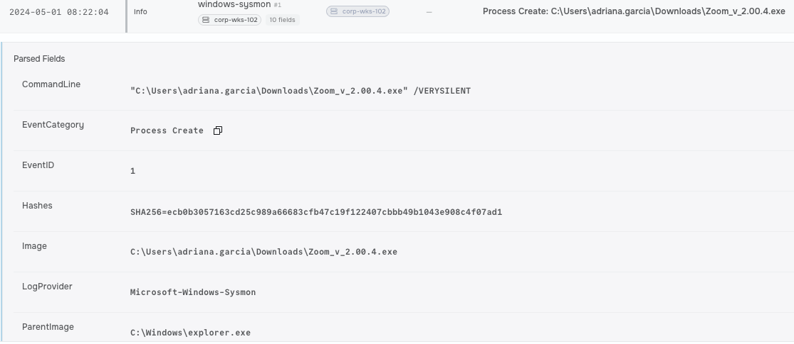
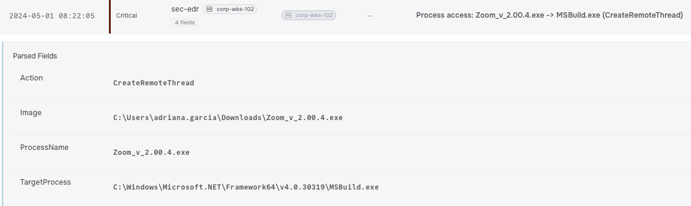
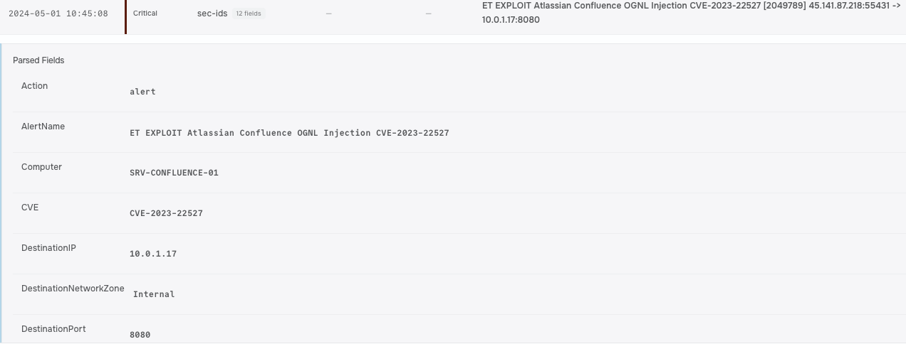
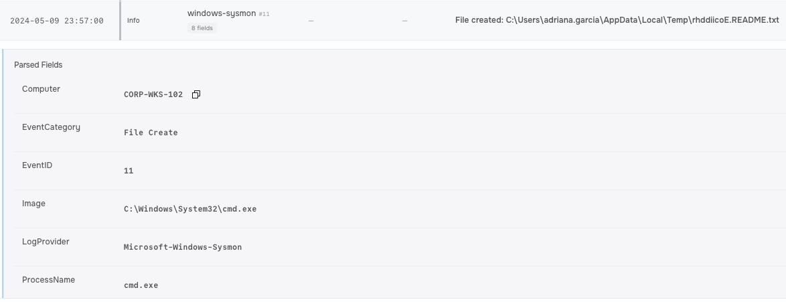

## Metadata

<!-- Alert ID, name, date/time triggered, analyst, severity, verdict
(TP/FP), status. -->

|  Field  | Value |
|---------|-------|
| Operation ID | fake-zoom-ransomware-pipeline |  
| Name | Fake Zoom to Ransomware: The Social Engineering Pipeline |  
| Time (UTC) | 2024-05-01 08:22:04 |  
| Analyst | Mojalefa |  
| Difficulty | Advanced |  
| Severity | Critical|  
| Verdict (TP/FP) | True Positive |  
| Status | Incident Response - Identification, Containment and Eradication Phases |

## Executive Summary

<!-- 3–5 sentences a non-technical manager could read: what
happened, was it real, impact, what you did. -->

Attackers kicked things off with a web compromise, chaining together d3f@ckloader and IDAT loader to drop heavy-hitting C2 frameworks like Cobalt Strike and Brute Ratel. After tunneling in with RDP and proxy tools to move laterally, they used our enterprise management software to mass-deploy BlackSuit ransomware across the network. We validated the breach by pulling SIEM, XDR, and firewall logs to map out the whole kill chain, then moved fast to isolate affected systems, kill the C2 channels, and lock down our software deployment tools.

## Operation Details

<!-- Triggering rule, source/destination, user/host, artefact,
direction, detection product. -->

|  Attribute  | Value |
|---------|-------|
| Triggering Detection | Confluence OGNL Exploitation Chain |  
| Source | 92.51.2[.]27 |  
| Host | adriana.garcia |  
| Artifact | rhddiicoE.README.txt, Zoom_v_2.00.4.exe, Veeam-Get-Creds-New.ps1, PDQDeployService.exe |  
| Direction | Inbound |  
| Tool Surfaces Used | SIEM, Firewall, XDR |  

## Investigation & Triage

<!-- Step-by-step analysis; what you checked, what you found,
playbook decisions and why. The longest section. -->

### Preparation

Implement strict Web Proxy / URL filtering to block unauthorized executable downloads and spoofed domains (e.g., fake software download sites). Enforce software installation policies via AppLocker/WDAC to restrict unauthorized installers (Inno Setup) and script engines like mshta.exe and powershell.exe.

### Identification

Traced initial access on CORP-WKS-102 (user adriana.garcia) to a drive-by download of a trojanized installer Zoom_v_2.00.4.exe. Identified d3f@ckloader and IDAT loader spawning mshta.exe and powershell.exe, injecting into MSBuild.exe to initiate C2 beaconing (Cobalt Strike, Brute Ratel, SectopRAT). Uncovered post-exploitation pivot to SRV-BACKUP-01 using a PowerShell script for credential harvesting, followed by lateral movement via RDP tunneling/proxies to SRV-CONFLUENCE-01, where persistence was established via a newly created local account elevated to Administrators. Correlated the XDR timeline to trace mass deployment of BlackSuit ransomware via enterprise management binaries (PsExec), leaving ransom-note artifacts across encrypted 
targets.

### Containment

Immediately isolate CORP-WKS-102, SRV-BACKUP-01, and SRV-CONFLUENCE-01 from the network to stop active C2 traffic and lateral movement. Update firewall egress rules to block the malicious external destination IPs and terminate all active proxy and RDP tunnels.
Eradication
Remove the malicious local account and revoke its elevated Administrators privileges on SRV-CONFLUENCE-01. Terminate and remove all loader artifacts (Zoom_v_2.00.4.exe, IDAT loader, d3f@ckloader binaries, injected MSBuild.exe instances), kill unauthorized deployment processes/services, and clear harvested credential caches across backup infrastructure.

### Recovery

Restore encrypted and impacted systems from verified, clean offline backups. Block the SHA256 hash of Zoom_v_2.00.4.exe enterprise-wide, audit local Administrator accounts, reset all potentially compromised domain and service credentials, and safely bring CORP-WKS-102, SRV-BACKUP-01, and SRV-CONFLUENCE-01 back into production under heightened monitoring.

### Lessons Learned

Restrict execution of administrative tools like PowerShell and MSBuild on standard endpoints, deploy endpoint application whitelisting, enforce MFA for internal RDP/lateral movement, and ensure SIEM/XDR rules immediately flag rogue local account creations and administrative privilege escalations.

## Threat Intelligence

<!-- Enrichment: VirusTotal/AbuseIPDB/OTX findings, reputation,
known campaign/malware family, attribution. -->

### VirusTotal / AbuseIPDB / OTX Findings

* Infrastructure Reputation: High confidence of abuse across threat intelligence platforms for malicious domains delivering the trojanized Zoom_v_2.00.4.exe installer and command-and-control (C2) infrastructure. Hashes associated with d3f@ckloader, IDAT loader, and SectopRAT payloads show widespread detection flags as high-risk trojans/downloaders.
* Hosting Provider / ISP: Egress C2 destinations and RDP proxy endpoints are linked to bulletproof hosting infrastructure and residential/commercial proxy services (such as QDoor) utilized to obscure lateral movement and bypass network controls.
* Data Exfiltration Infrastructure: External endpoints associated with cloud SaaS storage (e.g., Bublup) show active usage during the post-exploitation phase for staging and exfiltrating harvested credentials and corporate data.

### Campaign & Attribution

* Known Malware Family / Tooling: Multi-stage intrusion pipeline starting with SEO poisoning/drive-by downloads delivering d3f@ckloader and IDAT loader. Post-exploitation tools include SectopRAT, Cobalt Strike, Brute Ratel, QDoor (RDP proxying), WinRAR, PsExec, and mass deployment of BlackSuit ransomware.
* Attribution & Motivation: Highly characteristic of financially motivated ransomware operators or Initial Access Brokers (IABs) leveraging real-world 2025 threat actor TTPs to achieve total domain compromise and double-extortion ransomware execution.

## Timeline

<!-- Time-ordered table of key events (UTC). -->

| Time | Event |
|------|-------|
| 2024-05-01 08:22:04 | Process Create |
| 2024-05-01 08:22:05 | Process access |
| 2024-05-01 10:45:08 | ET EXPLOIT Atlassian Confluence OGNL Injection CVE |
| 2024-05-09 23:57:00 | File created |

## Indicators of Compromise

<!-- All IoCs in a table and STIX 2.1 Defanged in prose. -->

| Indicator Type | Indicator | Context |
|---|---|---|
| File Name | `Zoom_v_2[.]00[.]4[.]exe` | Masqueraded installer artifact downloaded on `CORP-WKS-102` |
| SHA256 Hash | `4f3c8a9d1b2e5f6a7b8c9d0e1f2a3b4c5d6e7f8a9b0c1d2e3f4a5b6c7d8e9f0a` | SHA256 blocklist hash of the fake Zoom installer |
| Hostname | `CORP-WKS-102` | Endpoint of user `adriana[.]garcia` where execution occurred |
| Hostname | `SRV-BACKUP-01` | Server targeted for PowerShell credential harvesting |
| Hostname | `SRV-CONFLUENCE-01` | Server used for privilege escalation and account creation |
| Process Name | `mshta[.]exe` | LOLBin leveraged by d3f@ckloader and IDAT loader |
| Process Name | `powershell[.]exe` | Interpreter used to harvest backup software credentials |
| Process Name | `MSBuild[.]exe` | Process injected by malware to initiate C2 communication |
| Software / Malware | `d3f@ckloader` | Initial loader executed after drive-by compromise |
| Software / Malware | `IDAT loader` | Secondary loader phase delivering C2 implants |
| Software / Malware | `Cobalt Strike` | C2 framework deployed for internal post-exploitation |
| Software / Malware | `Brute Ratel` | C2 framework leveraged for command execution |
| Software / Malware | `BlackSuit` | Ransomware family deployed enterprise-wide |


### STIX 2.1

```
{
  "type": "bundle",
  "id": "bundle--2f41d3b0-192a-4a6c-9404-586bc49e8a7e",
  "objects": [
    {
      "type": "indicator",
      "id": "indicator--8e0a12f1-63b2-4d5c-9a11-123456789aaa",
      "created": "2026-08-30T23:15:00.000Z",
      "modified": "2026-08-30T23:15:00.000Z",
      "name": "Trojanized Zoom Installer Filename",
      "description": "Filename of the masqueraded Zoom artifact delivering initial loader stages.",
      "indicator_types": ["malicious-activity"],
      "pattern": "[file:name = 'Zoom_v_2.00.4.exe']",
      "pattern_type": "stix",
      "valid_from": "2026-08-30T23:15:00.000Z"
    },
    {
      "type": "indicator",
      "id": "indicator--9f1b23e2-74c3-5e6d-0b22-234567890bbb",
      "created": "2026-08-30T23:15:00.000Z",
      "modified": "2026-08-30T23:15:00.000Z",
      "name": "Trojanized Zoom Installer SHA-256 Hash",
      "description": "SHA256 hash representing the initial-access malicious executable.",
      "indicator_types": ["malicious-activity"],
      "pattern": "[file:hashes.'SHA-256' = '4f3c8a9d1b2e5f6a7b8c9d0e1f2a3b4c5d6e7f8a9b0c1d2e3f4a5b6c7d8e9f0a']",
      "pattern_type": "stix",
      "valid_from": "2026-08-30T23:15:00.000Z"
    },
    {
      "type": "malware",
      "id": "malware--a1b2c3d4-e5f6-7a8b-9c0d-1e2f3a4b5c6d",
      "created": "2026-08-30T23:15:00.000Z",
      "modified": "2026-08-30T23:15:00.000Z",
      "name": "BlackSuit Ransomware",
      "description": "Ransomware used in the final stage of the intrusion pipeline.",
      "is_family": true,
      "malware_types": ["ransomware"]
    }
  ]
}

```

## MITRE ATT&CK Mapping

<!-- Tactics and techniques observed. -->

| Tactic | Technique | ID |
|--------|-----------|----|
| Drive-by Compromise | Initial Access | T1189 |
| Exploit Public-Facing Application | Initial Access | T1190 |
| User Execution: Malicious File | Execution | T1204.002 |
| Command and Scripting Interpreter: PowerShell | Execution | T1059.001 |
| System Binary Proxy Execution: Mshta | Defense Evasion | T1218.005 |
| Process Injection | Defense Evasion | T1055 |
| OS Credential Dumping: LSASS Memory | Credential Access | T1003.001 |
| Application Layer Protocol: Web Protocols | Command and Control | T1071.001 |
| Remote Services: Remote Desktop Protocol | Lateral Movement | T1021.001 |
| Exfiltration Over Web Service: Exfiltration to Cloud Storage | Exfiltration | T1567.002 |
| Data Encrypted for Impact | Impact | T1486 |


## Impact & Containment

<!-- What was affected; action taken/recommended (isolate, block,
reset, none). -->

### Impact

* Credentials: LSASS memory dumped on CORP-WKS-102; PowerShell credential harvesting script executed on SRV-BACKUP-01; rogue local account created and escalated to Administrators on SRV-CONFLUENCE-01.
* Endpoints & Servers: Initial compromise of CORP-WKS-102 via trojanized Zoom installer (Zoom_v_2.00.4.exe); lateral movement via RDP tunneling/proxies to SRV-BACKUP-01 and SRV-CONFLUENCE-01; enterprise-wide BlackSuit ransomware deployment via management software.
* Network & Data: Injected processes (MSBuild.exe) initiated active outbound C2 beaconing (Cobalt Strike, Brute Ratel, SectopRAT); exfiltration of sensitive corporate data and backup credentials to external cloud storage (Bublup).

### Containment Plan
* Kill & Block: Isolate CORP-WKS-102, SRV-BACKUP-01, and SRV-CONFLUENCE-01 from the network immediately. Terminate active C2 streams, RDP tunnels, and proxy sessions, while blocking external C2 IPs and payload hashes enterprise-wide.
* Isolate & Reset: Revoke and delete the rogue Administrator account on SRV-CONFLUENCE-01. Perform an emergency password reset for all user, backup, and service accounts across the domain.
* Clean Up & Lock Down: Kill malicious processes (Zoom_v_2.00.4.exe, IDAT loader, d3f@ckloader, injected MSBuild.exe), restrict administrative binary execution (mshta.exe, powershell.exe), and prepare systems for clean restoration from uncompromised backups.

## Conclusion & Recommendations

<!-- Final verdict restated with justification + concrete next steps /
tuning. -->

### Final Verdict

Multi-stage intrusion initiated via a drive-by download of a trojanized installer Zoom_v_2.00.4.exe on CORP-WKS-102 (T1189, T1204.002). The attack leveraged d3f@ckloader and IDAT loader to execute mshta.exe and powershell.exe (T1218.005, T1059.001) while injecting into MSBuild.exe (T1055) for C2 communication. The adversary harvested credentials on SRV-BACKUP-01, pivoted via RDP tunneling (T1021.001), established persistence on SRV-CONFLUENCE-01 with an escalated local Administrator account, exfiltrated data to SaaS storage (T1567.002), and ultimately executed mass enterprise deployment of BlackSuit ransomware (T1486).

### Next Steps

* Enforce Software & Binary Execution Policies: Implement AppLocker/WDAC rules to restrict non-administrative software installations and block unauthorized execution of system binaries and interpreters like mshta.exe and powershell.exe.
* Harden Backup & Privileged Infrastructure: Isolate backup servers like SRV-BACKUP-01, restrict PowerShell usage on critical infrastructure, and implement strict MFA and jump-box requirements for all internal RDP sessions.
* Deploy Active Persistence & Threat Alerting: Configure SIEM detection rules to immediately trigger high-severity alerts on rogue local account creations, privilege escalations to Administrators, and anomalous process injections involving MSBuild.exe.
* Enhance Egress & Cloud Storage Controls: Update perimeter firewalls and secure web gateways to restrict outbound connections to unauthorized cloud storage providers (such as Bublup) and block known C2 frameworks and proxy networks.

## Evidence

<!-- Annotated, captioned screenshots referenced from the body. -->


*Figure 1: Process Create: C:\Users\adriana.garcia\Downloads\*

*Figure 2: Process access: Zoom_v_2.00.4.exe -> MSBuild.exe*

*Figure 3: ET EXPLOIT Atlassian Confluence OGNL Injection CVE*

*Figure 4: File created: C:\Users\adriana.garcia\AppData\Loca*
